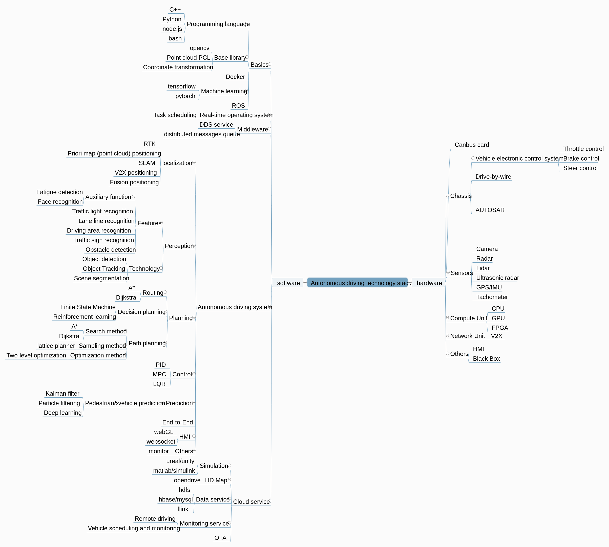

# Awesome Self-Driving Cars [](https://github.com/sindresorhus/awesome)


## Introduction
A curated list of all awesome things related to self-driving car.


## Table of Contents
- [Opensource code](#opensource)
  - [Fullstack](#fullstack)
  - [Library](#library)
- [Courses](#courses)
- [Papers & Blogs](#papers-blogs)
  - [Overview](#overview)
  - [HD Map](#hd-map)
  - [Simulation & Data generation](#simulation)
  - [Localization](#localization)
  - [Calibration](#calibration)
  - [Perception](#perception)
  - [Prediction](#prediction)
  - [Planning](#planning)
  - [Control](#control)
  - [End-to-End](#end2end)
  - [Misc](#misc)  
- [Datasets & Benchmarks](#datasets)
- [Algorithms](#algorithms)
  - [Overview](#algorithms_overview)
  - [HD Map](#algorithms_hd-map)
  - [Simulation & Data generation](#algorithms_simulation)
  - [Localization](#algorithms_localization)
  - [Calibration](#algorithms_calibration)
  - [Perception](#algorithms_perception)
  - [Prediction](#algorithms_prediction)
  - [Planning](#algorithms_planning)
  - [Control](#algorithms_control)
  - [End-to-End](#algorithms_end2end)
  - [Misc](#algorithms_misc)
- [Systems](#systems)
  - [RTOS](#rtos)  
- [Cloud service](#cloud_service)
  - [Simulation Service](#simulation_service)
  - [HD Map Service](#hd_map_service)
  - [Data Service](#data_service)
  - [Monitor Service](#monitor_service)
  - [OTA](#ota)  
- [Hardware](#hardware)
  - [Computing Unit](#computing-unit)
  - [sensors](#sensors)
    - [GPS/IMU](#gps-imu)
    - [Camera](#camera)
    - [LiDAR](#lidar)
    - [RADAR](#radar)
    - [Ultrasonic Sensor](#ultrasonic-sensor)
  - [CAN card](#can_card)
  - [Drive by wire](#drive-by-wire) 
  - [V2X](#v2x)  
  - [HMI Device](#hmi-device)
  - [Black Box](#black-box)
- [Big Players](#big-players)
- [Legislation](#legislation)


## Autonomous driving technology stack
First, let's look at the technology stack for autonomous driving. In order to understand the full stack of autonomous driving. After that, you can learn the corresponding skill tree.  
  


<a name="opensource" />

## Opensource

<a name="fullstack" />

#### Fullstack
* [apollo](http://apollo.auto/) - Apollo is an open source autopilot platform that contains almost everything. Including hardware, systems, vehicle platforms, cloud services, etc. You can quickly build a self-driving system of your own by Apollo.
* [autoware](https://www.autoware.ai/) - The original Autoware project built on ROS 1. Launched as a research and development platform for autonomous driving technology.
* [openpilot](https://comma.ai/) - Openpilot is an open source driver agent. Use the iphone to control the car, which provides adaptive cruise control (ACC) and lane keeping assist (LKAS).


<a name="library" />

#### Library
* [ROS](http://www.ros.org/) - The Robot Operating System (ROS) is a flexible framework for writing robot software. It is a collection of tools, libraries, and conventions that aim to simplify the task of creating complex and robust robot behavior across a wide variety of robotic platforms.
* [OpenCV library](https://opencv.org/) - OpenCV (Open Source Computer Vision Library) is an open source computer vision and machine learning software library. OpenCV was built to provide a common infrastructure for computer vision applications and to accelerate the use of machine perception in the commercial products.
* [Point Cloud Library](http://pointclouds.org/) - Point Cloud Library (PCL) is a standalone, large open project for 2D / 3D imagery and point cloud processing. Widely used to process laser point cloud data.
* [TensorFlow](https://www.tensorflow.org/) - TensorFlow is an open source software library for numerical computation using data flow graphs. Used for automatic driving perception and prediction.


<a name="courses" />

## Courses
* [Udacity Self-Driving Car Nanodegree](https://www.udacity.com/course/self-driving-car-engineer-nanodegree--nd013) - Udacity's flagship program is sponsored by many self-driving car hiring partners. The nanodegree program includes 3 terms: 1) [Term 1: Computer Vision and Deep Learning](https://medium.com/self-driving-cars/term-1-in-depth-on-udacitys-self-driving-car-curriculum-ffcf46af0c08#.k5745vhdw), 2) [Term 2: Sensor Fusion, Localization, and Control](https://medium.com/udacity/term-2-in-depth-on-udacitys-self-driving-car-curriculum-775130aae502#.oh8xi152p), and 3) Term 3: Path Planning, Elective, and Systems. Each term costs $800.
* [MIT 6.S094: Deep Learning for Self-Driving Cars](http://selfdrivingcars.mit.edu/) - This class is an introduction to the practice of deep learning through the applied theme of building a self-driving car. It is open to beginners and is designed for those who are new to machine learning, but it can also benefit advanced researchers in the field looking for a practical overview of deep learning methods and their application. By the way, it's *free*!
* [BitTiger Build Your Own Autonomous Vehicle Mastery Program](https://www.bittiger.io/livecourses/2yG3CYMWRdAgDguzK) - Two weeks of live classes in Bay Area taught by engineers from [Vector.ai](http://vectorai.io/) on building a self-driving mini car from ground up. Topics include deep learning, ROS, sensors, computer vision, localization, mapping and control. The program costs $7,000.
* [Apollo Autopilot Introduction](http://bit.baidu.com/Subject/index/id/16.html) - Note:  it's a Chinese tutorial. This is an open class between Baidu and Peking University. It is very comprehensive and detailed, which is a good introductory course.


<a name="papers-blogs" />

## Papers & Blogs

<a name="overview" />

#### Overview
**[1]** Ekim Yurtsever, Jacob Lambert, Alexander Carballo, Kazuya Takeda.**A Survey of Autonomous Driving: Common Practices and Emerging Technologies**." arXiv:1906.05113 arXiv:1906.05113v2 (2020). [[pdf]](https://arxiv.org/pdf/1906.05113.pdf) **(Very very comprehensive introduction)** :star::star::star::star::star:  
**[2]** Claudine Badue, Rânik Guidolini, Raphael Vivacqua Carneiro etc.**Self-Driving Cars: A Survey**." arXiv:1901.04407v2 (2019). [[pdf]](https://arxiv.org/pdf/1901.04407.pdf) **(Very comprehensive introduction)** :star::star::star::star:  
**[3]** Jesse Levinson, Jake Askeland, Jan Becker etc.**Towards Fully Autonomous Driving: Systems and Algorithms**." DOI: 10.1109/IVS.2011.5940562 (2011). [[pdf]](https://www.ri.cmu.edu/wp-content/uploads/2017/12/levinson-iv2011.pdf) **(Very very comprehensive introduction)** :star::star::star::star::star:  
**[4]** Sorin Grigorescu, Bogdan Trasnea, Tiberiu Cocias, Gigel Macesanu **A Survey of Deep Learning Techniques for Autonomous Driving**." arXiv:1910.07738v2 (2020). [[pdf]](https://arxiv.org/pdf/1910.07738.pdf) **(Very very comprehensive introduction)** :star::star::star::star:star:  

<a name="hd-map" />

#### HD Map

* [Highiy Efficient HD Map Creation: Acceierating Mapping Process with GPUs](http://on-demand.gputechconf.com/gtc/2017/presentation/s7656-shigeyuki-iwata-accelerating-hd-mapping.pdf) - 2017 An introduction PPT

<a name="simulation" />

#### Simulation & Data generation

<a name="localization" />

#### Localization
**Survey**    
* [A survey of the state-of-the-art localization techniques and their potentials for autonomous vehicle applications](#) - 2018
* [Simultaneous localization and mapping: A survey of current trends in autonomous driving](#) - 2017

**Details**
* [Robust and Precise Vehicle Localization based on Multi-sensor Fusion in Diverse City Scenes](https://arxiv.org/abs/1711.05805) - Present a robust and precise localization system that achieves centimeter-level localization accuracy in disparate city scenes by sensor fusion.
* [Map-Based Precision Vehicle Localization in Urban Environments](http://www.roboticsproceedings.org/rss03/p16.pdf) - 
* [Robust Vehicle Localization in Urban Environments Using Probabilistic Maps](http://driving.stanford.edu/papers/ICRA2010.pdf) -

<a name="perception" />

#### Perception
**Survey**  
* [Computer Vision for Autonomous Vehicles: Problems, Datasets and State-of-the-Art](https://arxiv.org/pdf/1704.05519.pdf) - State-of-the-art survey on computer vision-related problems datasets and methods for self-driving cars.

**Object Detection**  
* [Object Detection in 20 Years: A Survey](#) - 2019
* [Object Detection With Deep Learning: A Review](#) - 
* [50 Years of object recognition: Directions forward](#) - 
* [Deep Learning for Generic Object Detection: A Survey](#) - 

**Lane Detection**  
* [Recent progress in road and lane detection: a survey](#) - 

<a name="prediction" />

#### Prediction

<a name="planning" />

#### Planning
* [A Survey of Motion Planning and Control Techniques for Self-driving Urban Vehicles](https://arxiv.org/abs/1604.07446) - A Survey.
* [A Review of Motion Planning Techniques for Automated Vehicles](#) - 

* [ChauffeurNet: Learning to Drive by Imitating the Best and Synthesizing the Worst](https://arxiv.org/abs/1812.03079) - Waymo's paper about how to train a policy for autonomous driving via imitation learning that is robust enough to drive a real vehicle.

* [Baidu Apollo EM Motion Planner](https://arxiv.org/abs/1807.08048) - A real-time motion planning system based on the Baidu Apollo (open source) autonomous driving platform.

<a name="control" />

#### Control
* [A Survey of Motion Planning and Control Techniques for Self-driving Urban Vehicles](#) - A Survey of Motion Planning and Control Techniques for Self-driving Urban Vehicles.

<a name="end2end" />

#### End-to-End
* [End to End Learning for Self-Driving Cars](https://arxiv.org/abs/1604.07316) - 2016 NVIDIA

<a name="misc" />

#### Misc
* [An Introduction to LIDAR](https://news.voyage.auto/an-introduction-to-lidar-the-key-self-driving-car-sensor-a7e405590cff) - Awesome introduction by [Voyage](http://voyage.auto/) about the key sensor of self-driving cars.
* [Learning a Driving Simulator](https://arxiv.org/abs/1608.01230) - [comma.ai](http://comma.ai/)'s approach for self-driving cars is based on an agent that learns to clone driver behaviors and plans maneuvers by simulating future events in the road. This paper investigates variational autoencoders with classical and learned cost functions using generative adversarial networks for embedding road frames. A transition model is learned in the embedded space using action conditioned Recurrent Neural Networks (RNNs). 
* [16 Questions About Self-Driving Cars](http://a16z.com/2017/01/06/selfdriving-cars-frank-chen/) - [a16z](http://a16z.com/)'s [Frank Chen](https://twitter.com/withfries2) goes over the 16 most commonly asked questions, *technical* and *non-technical*, about self-driving cars.
* [Ways to think about cars](http://ben-evans.com/benedictevans/2015/7/27/ways-to-think-about-cars) - Awesome blog post by [a16z](http://a16z.com/)'s [Benedict Evans](https://twitter.com/BenedictEvans) on electric cars, on-demand car services, and self-driving cars.
* [The Third Transportation Revolution](https://medium.com/@johnzimmer/the-third-transportation-revolution-27860f05fa91#.ga97y7w86) - Awesome blog post by [John Zimmer](https://twitter.com/johnzimmer) on [Lyft](https://www.lyft.com/)'s vision for self-driving cars. *Spoiler alert*, John predicts self-driving cars will account for the majority of Lyft rides within 5 years. And by 2025, private car ownership will all-but end in major U.S. cities.
* [Cars and second order consequences](http://ben-evans.com/benedictevans/2017/3/20/cars-and-second-order-consequences) - [Benedict Evans](https://twitter.com/BenedictEvans) on the impact of electric and autonomy on cars and beyond.


<a name="datasets" /> 

## Datasets & Benchmarks
* [KITTI Vision Benchmark Suite [Images]](http://www.cvlibs.net/datasets/kitti/) - Large vision benchmark dataset with [objection detection](http://www.cvlibs.net/datasets/kitti/eval_object.php) evaluation training/testing images and leaderboard on cars and pedestrians.
* [Cityscapes](https://www.cityscapes-dataset.com/) - Semantic, instance-wise, dense pixel annotations of 30 classes.
* [comma.ai's Driving Dataset [Videos]](https://github.com/commaai/research) - Seven and a quarter hours (~ 80 GB) of largely highway driving. With this dataset, comma.ai's founder [George Hotz](https://twitter.com/realgeorgehotz) trained a self-driving car [all by himself](https://www.bloomberg.com/features/2015-george-hotz-self-driving-car/).
* [Udacity's Driving Dataset [Videos]](https://github.com/udacity/self-driving-car/tree/master/datasets) - Eight hours (over 280 GB) of driving data collected for their [open source self-driving car challenges](https://www.udacity.com/self-driving-car). Udacity also provides convenient [scripts](https://github.com/rwightman/udacity-driving-reader) to port the data.
* [Washington DC's Lidar Data](https://aws.amazon.com/blogs/publicsector/lidar-data-for-washington-dc-is-available-as-an-aws-public-dataset/) - Lidar point cloud of the entire Washington DC area is made available by the District of Columbia’s Office of the Chief Technology Officer (OCTO).
* [Apolloscape](http://apolloscape.auto/scene.html#) - Apolloscape provides images with 10x higher resolution and pixel-level annotation. And also Provides multiple levels of scene complexity.
* [nuScenes](https://www.nuscenes.org/overview) - The nuScenes dataset (pronounced /nuːsiːnz/) is a public large-scale dataset for autonomous driving provided by nuTonomy-Aptiv.
* [Waymo Open Dataset](https://waymo.com/open/) - The Waymo Open Dataset is comprised of high-resolution sensor data collected by Waymo self-driving cars in a wide variety of conditions. 


#### Traffic Sign
* [STSD](https://www.cvl.isy.liu.se/research/datasets/traffic-signs-dataset/) - More than 20 000 images with 20% labeled, Contains 3488 traffic signs.  
* [LISA](http://cvrr.ucsd.edu/LISA/lisa-traffic-sign-dataset.html) - 7855 annotations on 6610 frames.  
* [Tsinghua-Tencent 100K](https://cg.cs.tsinghua.edu.cn/traffic-sign/) - 100000 images containing 30000 traffic-sign instances.  
* [German Traffic Sign [Images]](http://benchmark.ini.rub.de/?section=gtsrb&subsection=dataset) - More than 50,000 images and 40 classes of traffic signs.


<a name="algorithms" />

## Algorithms

<a name="systems" />

## Systems

<a name="rtos" />

#### RTOS


<a name="cloud_service" />

## Cloud service

<a name="simulation_service" /> 

#### Simulation Service
* [Udacity's Self-Driving Car Simulator](https://github.com/udacity/self-driving-car-sim) - This simulator is built for Udacity's Self-Driving Car Nanodegree to teach students how to train cars how to navigate road courses using deep learning. It is used for the project of [Behavioral Cloning](https://github.com/udacity/CarND-Behavioral-Cloning-P3).
* [Microsoft's AirSim](https://github.com/Microsoft/AirSim) - An open-source and cross platform simulator built for drones and other vehicles. AirSim is designed as a platform for AI research to experiment with deep learning, computer vision and reinforcement learning algorithms for autonomous vehicles. 
* [MIT's Moral Machine](http://moralmachine.mit.edu/) - Moral machine provides a *"platform for 1) building a crowd-sourced picture of human opinion on how machines should make decisions when faced with moral dilemmas, and 2) crowd-sourcing assembly and discussion of potential scenarios of moral consequence"*. If you are a fan of the [trolley problem](https://en.wikipedia.org/wiki/Trolley_problem), you can't miss this.
* [MIT's Google Self-Driving Car Simulator](https://scratch.mit.edu/projects/108721238/) - Self-driving car simulated completely by visual programming language [Scratch](https://en.wikipedia.org/wiki/Scratch_(programming_language)).
* [Carla](http://carla.org/) - CARLA has been developed from the ground up to support development, training, and validation of autonomous driving systems.
* [Lgsvl](https://www.lgsvlsimulator.com/) - The LGSVL Simulator is a simulator that facilitates testing and development of autonomous driving software systems. The LGSVL simulator is developed by the Advanced Platform Lab at the LG Electronics America R&D Center, formerly the LG Silicon Valley Lab.


<a name="hd_map_service" /> 

#### HD Map Service


<a name="data_service" /> 

#### Data Service


<a name="monitor_service" /> 

#### Monitor Service


<a name="ota" /> 

#### OTA


<a name="hardware" />

## Hardware

<a name="computing-unit" />

#### Computing Unit


<a name="sensors" />

#### Sensors


<a name="gps-imu" />

###### GPS/IMU

<a name="camera" />

###### Camera

<a name="lidar" />

###### LiDAR

<a name="radar" />

###### RADAR

<a name="ultrasonic-sensor" />

###### Ultrasonic Sensor

<a name="can_card" />

#### CAN card

<a name="drive-by-wire" />

#### Drive by wire

<a name="v2x" />

#### V2X

<a name="hmi-device" />

#### HMI Device

<a name="black-box" />

#### Black Box


<a name="big-players" />

## Big Players

```
If I have seen further it is by standing on ye sholders of Giants.
                                                                - Isaac Newton
```
| | | | | |
|------------------------------------------------|-------------------------------------------------|--------------------------------------|-----------------------------------------|----------------------------------------|
| [Waymo](https://waymo.com/)                    | [Cruise Automation](https://www.getcruise.com/) | [Pony.ai](https://www.pony.ai/)      | [Baidu](https://apollo.auto/)           | [Nuro](https://nuro.ai/)               |
| [Zoox](https://zoox.com/)                      | [Lyft](https://www.lyft.com/)                   | [Autox](https://www.autox.ai/)       | [Mercedes Benz](https://www.mbusa.com/) | [Aurora](https://aurora.tech/)         |
| [Apple](https://www.apple.com)                 | [NVIDIA](http://www.nvidia.com/page/home.html)  | [AImotive](https://aimotive.com/)    | [WeRide](https://www.weride.ai/)        | [Drive.ai](drve.ai/)                   |
| [SF Motors/Seres](https://www.driveseres.com/) | [Nullmax](https://nullmax.ai/)                  | [Nissan](https://www.nissanusa.com/) | [SAIC](https://saicic.com/)             | [Qualcomm ](https://www.qualcomm.com/) |


<a name="legislation" />

## Legislation
* **Arizona** - [Executive order 2015-09](http://azgovernor.gov/file/2660/download?token=nLkPLRi1) was signed to direct all state agencies to *undertake any necessary steps to support the testing and operation of self-driving vehicles on public roads within Arizona*. The executive order also specifies that in Arizona the operator of a self-driving vehicle does *not* have to be physically inside the vehicle. The vehicle can be directed remotely in self-driving mode.
* **Colorado** - Colorado [passes first law](http://www.denverpost.com/2017/06/01/colorado-law-regulate-driverless-vehicles/) to regulate self-driving cars. Companies who plan to test self-driving cars in Colorado need to first check in with the state Department of Transportation and State Patrol.
* [**California**](https://www.dmv.ca.gov/portal/dmv/detail/vr/autonomous/bkgd) - Application required for [testing self-driving cars](https://www.dmv.ca.gov/portal/dmv/detail/vr/autonomous/testing). Manufacturers are required to provide [accident reports](https://www.dmv.ca.gov/portal/dmv/detail/vr/autonomous/autonomousveh_ol316+) and [disengagement reports](https://www.dmv.ca.gov/portal/dmv/detail/vr/autonomous/disengagement_report_2016). The regulations for [post-testing deployment](https://www.dmv.ca.gov/portal/dmv/detail/vr/autonomous/auto) of self-driving cars have been drafted and will establish the requirements for manufacturers to meet prior to operation on California’s on public roads.
* **New York** - It is [announced](https://www.governor.ny.gov/news/governor-cuomo-announces-autonomous-vehicle-testing-begin-new-york-state) on May 10, 2017 that the state is accepting application for self-driving car testing. The pilot testing program is included in FY 2018 and can be further extended.
* **Texas** - Bill [SB 2205](http://www.capitol.state.tx.us/Search/DocViewer.aspx?ID=85RSB022051A&QueryText=%22SB+2205%22&DocType=A) is proposed to implement minimum safety requirements and accelerate testing of self-driving cars on public roads. The bill passed the Texas Senate Transportation Committee and it is currently pending Senate debate and referral to the House.
* **Virginia** - Arguably the most friendly state to self-driving cars with no application or permit required and [$25M per year fund](https://www.washingtonpost.com/local/trafficandcommuting/virginia-wants-to-steal-some-of-californias-driverless-thunder/2017/04/23/a4bc6b54-206c-11e7-a0a7-8b2a45e3dc84_story.html?utm_term=.cfaac3ec962d) set to facilitate self-driving cars. [Virginia Automated Corridors](https://governor.virginia.gov/newsroom/newsarticle?articleId=8526) is announced to offer self-driving car developers the opportunity to *test their technologies on Virginia roads covering more than 70 miles of interstates and arterials in the Northern Virginia region*.
* **Singapore** -
* **China** -
* **South Korea** -
* **Japan** -
* **Europe** -


